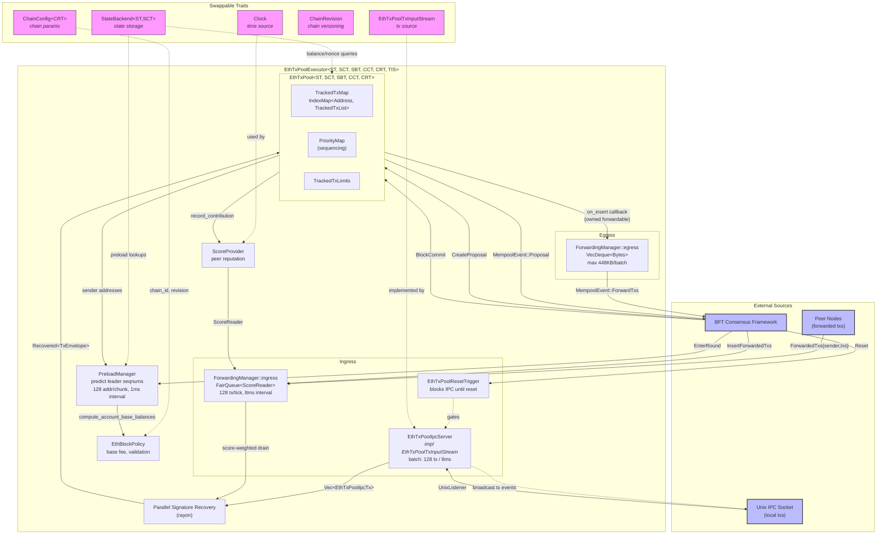
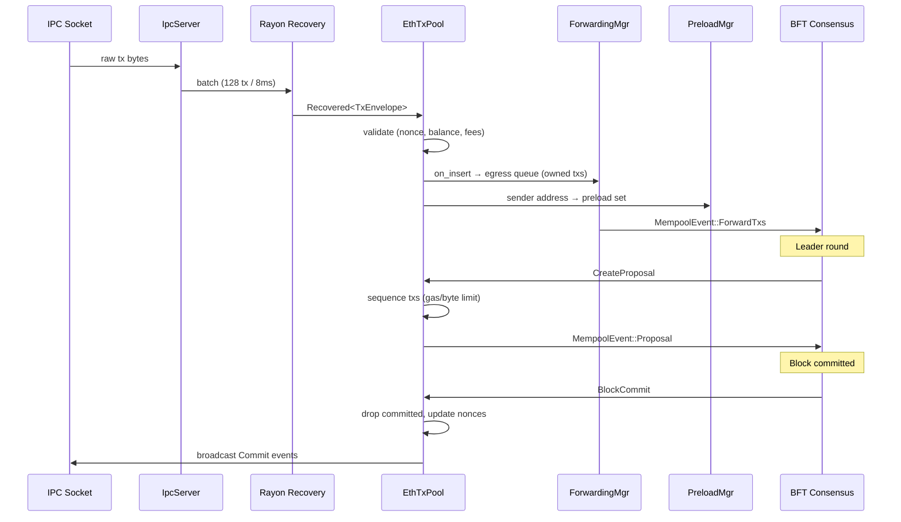

# TxPool Executor Architecture

## Component Overview



## Transaction Lifecycle



## Swappable Abstractions

| Trait | Abstracts | Current Impl | Test Impl |
|-------|-----------|-------------|-----------|
| `EthTxPoolTxInputStream` | Transaction source | `EthTxPoolIpcServer` (Unix socket) | Custom streams |
| `StateBackend<ST,SCT>` | State storage & queries | Persistent backend | `InMemoryState` |
| `ChainConfig<CRT>` | Chain parameters | Production config | `MockChainConfig` |
| `ChainRevision` | Chain version rules | Typed revisions | `MockChainRevision` |
| `Clock` | Time source | `StdClock` | `MockClock` |

**Not swappable (concrete):** `EthTxPool`, `TrackedTxMap`, `ForwardingManager`, `PreloadManager`, `EthBlockPolicy`, `ScoreProvider`, `FairQueue`.

## Channel Architecture

```
EthTxPoolExecutorClient (spawns executor on dedicated tokio task)

  command_tx  ──(1024)──►  EthTxPoolExecutor::run()
  forwarded_tx ─(1024)──►    tokio::select! { biased }
                                │ 1. commands (highest)
  event_rx    ◄──(1024)──      │ 2. IPC + forwarding ingress + preload
                                │ 3. forwarded txs (lowest)
```

## Key Constants

| Parameter | Value |
|-----------|-------|
| IPC batch size | 128 txs |
| IPC batch timeout | 8ms |
| Ingress drain per tick | 128 txs |
| Ingress tick interval | 8ms |
| Preload chunk size | 128 addresses |
| Preload interval | 1ms |
| Egress max batch | 448 KB |
| Per-peer ingress limit | 10,000 txs |
| Global ingress limit | 100,000 txs |
| New-peer bandwidth share | 10% |
| Egress min commit diff | 5 seqnums |
| Egress max retries | 3 |
