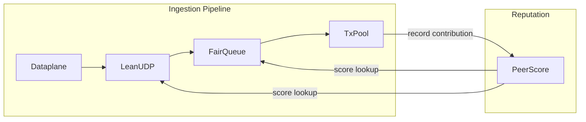

# Sybil-Resistant Transaction Ingestion

## Table of Contents

- [Sybil-Resistant Transaction Ingestion](#sybil-resistant-transaction-ingestion)
  - [Table of Contents](#table-of-contents)
  - [Rationale](#rationale)
  - [Summary](#summary)
  - [Peer Score](#peer-score)
    - [Score Computation](#score-computation)
    - [Contribution Recording](#contribution-recording)
    - [Two-Tier Identity Storage](#two-tier-identity-storage)
  - [Weighted Fair Queue](#weighted-fair-queue)
    - [Dual-Pool Architecture](#dual-pool-architecture)
    - [Weighted Fair Queueing](#weighted-fair-queueing)
    - [Priority Pool Fallback](#priority-pool-fallback)
  - [LeanUDP Fragmentation](#leanudp-fragmentation)
    - [Packet Format](#packet-format)
    - [Fragment Reassembly](#fragment-reassembly)
    - [Reassembly Pool Eviction](#reassembly-pool-eviction)
  - [Impact on Other Components](#impact-on-other-components)
  - [Security Analysis](#security-analysis)
    - [Naive Flooding](#naive-flooding)
    - [Mempool Monopolization](#mempool-monopolization)
    - [Graceful Degradation](#graceful-degradation)

## Rationale

The current implementation processes transactions in arrival order without identity-based prioritization. This creates two vulnerabilities:

1. Bandwidth exhaustion: An attacker flooding the network can consume the entire ingestion pipeline, causing honest transactions to be delayed or dropped.

2. Unfair resource allocation: High-volume senders receive bandwidth proportional to their submission rate rather than their contribution to the network.

## Summary

This specification defines a sybil-resistant transaction ingestion protocol that allocates bandwidth fairly among authenticated peers based on their contributions to the network.



The protocol consists of three components:

1. Peer Score: A reputation system that tracks peer contributions over time, computing scores that reflect both contribution history and recency of activity.

2. Weighted Fair Queue: A dual-pool queue that separates authenticated identities with positive reputation from unknown identities, allocating bandwidth proportionally to identity scores within the priority pool.

3. LeanUDP Fragmentation: A message fragmentation layer that integrates with peer scores.

These components ensure that peers who have consistently contributed valid transactions to the network receive proportionally higher bandwidth allocation, while unknown or low-reputation peers are rate-limited to a configurable fraction of total capacity.

## Peer Score

An identity is a public key that owns a wireauth session. All reputation tracking uses this public key as the identifier. The number of identities per IP address is limited to prevent a single IP from creating unbounded sessions.

### Score Computation

```
ema_gas(t) = α × gas_this_block + (1 - α) × ema_gas(t - 1)
α = 1 - 0.5^(block_time / ema_half_life)
time_weight = min((time_known / time_weight_unit)^2, max_time_weight)
score = ema_gas × time_weight
```

Gas contribution is tracked as an exponential moving average (EMA) of gas spent per block. The EMA naturally decays toward the current contribution rate, so peers must continuously contribute to maintain their score. Unlike a cumulative model with idle-based decay, the EMA cannot be maintained cheaply by sending occasional minimal transactions — score always converges toward the actual recent gas rate.

Time weight grows quadratically from 0 to 1 over 1 hour, giving established identities a 3,600x advantage over 1-minute-old ones. Quadratic growth offsets attacks using short-term IP rental.

Peers receive bandwidth proportional to their gas contribution rate without any cap. A peer contributing 5x the gas rate of another gets 5x the bandwidth from a single identity, eliminating the incentive to split into multiple identities.

Default parameters:

| Parameter | Value | Description |
|-----------|-------|-------------|
| time_weight_unit | 1 hour | Time for weight to reach 1.0 |
| max_time_weight | 1.0 | Cap on time multiplier |
| ema_half_life | 24 hours | EMA half-life; score halves after 24h of inactivity |
| promotion_threshold | configurable | Score required to enter promoted pool and priority queue |
| max_identities | 100,000 | Eviction threshold for least recently active |

### Contribution Recording

Contributions are recorded as gas spent per identity per block. When a block includes transactions from an identity, the total gas used by those transactions updates the identity's EMA.

Gas-based counting ties attack cost directly to on-chain fees. The EMA ensures score reflects recent contribution rate rather than historical peak, preventing attackers from accumulating score cheaply and coasting on it.

The scoring model intentionally avoids negative reputation (penalties for invalid transactions or spam). This keeps the model simple. Penalties may be introduced in future iterations if the positive-only approach proves insufficient against observed attack patterns.

### Two-Tier Identity Storage

To prevent identity table eviction attacks, the scorer maintains two separate pools:

| Pool | Capacity | Entry Condition | Eviction |
|------|----------|-----------------|----------|
| Promoted | 90,000 | score ≥ promotion_threshold | LRU within pool |
| Newcomers | 10,000 | score < promotion_threshold | LRU within pool |

New identities enter the newcomers pool. Migration between pools happens on demand: when a newcomer's score crosses above the promotion threshold and the promoted pool is full, the LRU promoted identity with a lower score is evicted back to newcomers to make room. If no such identity exists, the newcomer stays in its current pool. When a promoted identity's score decays below the threshold, it moves back to the newcomers pool. Flooding with new identities only evicts other newcomers; promoted peers remain protected.

Scores are not persisted across restarts. On node restart, all identities start fresh with zero score. Persistence may be considered in future iterations.

## Weighted Fair Queue

### Dual-Pool Architecture

The fair queue maintains two separate pools with distinct policies:

| Property | Priority Pool | Regular Pool |
|----------|---------------|--------------|
| Bandwidth share | 90% | 10% |
| Scheduling | Weighted by score | Equal weights |
| Max size | 100,000 | 100,000 |
| On overflow | Drop incoming | Drop incoming |

Incoming transactions are routed based on authentication status and score. Authenticated identities with scores at or above `promotion_threshold` enter the priority pool; all others enter the regular pool.

The bandwidth split between pools defaults to 90/10. During dequeue, a counter cycles to probabilistically select which pool to serve, achieving the configured ratio over time. The design is work-conserving: when the selected pool is empty, the other pool is served instead.

### Weighted Fair Queueing

Within each pool, bandwidth is allocated using weighted fair queueing (WFQ). Each identity maintains a virtual finish time that determines scheduling priority:

```
finish_time(i) = virtual_time + (1 / score(i))
```

When a transaction is dequeued, the global virtual time advances to the finish time of the selected identity, and that identity's finish time is recalculated for its next queued transaction.

The algorithm guarantees that over time, each identity receives bandwidth proportional to its score. An identity with score 10 receives 10x the bandwidth of an identity with score 1.

### Priority Pool Fallback

When the priority pool cannot accept a transaction, promoted identities fall back to the regular pool rather than being rejected. This provides a safety mechanism if scoring is abused to block new identities.

## LeanUDP Fragmentation

LeanUDP is a lightweight protocol for fragmenting and reassembling large messages over plain UDP. It operates over authenticated UDP sessions and is designed for fast, short-lived message delivery where all fragments arrive within a narrow time window. Unlike TCP, it provides no retransmission or flow control; incomplete messages are discarded after a brief timeout.

### Packet Format

Large messages are fragmented for transmission over authenticated UDP sessions. Each fragment carries an 8-byte header:

| Field | Size | Description |
|-------|------|-------------|
| Version | 1 byte | Protocol version (currently 1) |
| Message ID | 3 bytes | Identifies fragments belonging to the same message within a single identity |
| Sequence Number | 2 bytes | Fragment index within message (0-65535) |
| Flags | 2 bytes | START (0x0001) and END (0x0002) flags indicating message boundaries |

Fragment types derived from flags:

| START | END | Type | Description |
|-------|-----|------|-------------|
| 1 | 1 | Complete | Single-fragment message |
| 1 | 0 | Start | First fragment of multi-fragment message |
| 0 | 0 | Middle | Interior fragment |
| 0 | 1 | End | Final fragment |

With default MTU of 1500 bytes, reserving 20 bytes for IP header, 8 bytes for UDP header, 32 bytes for wireauth header, and 8 bytes for leanudp header, maximum fragment payload is 1432 bytes.

Maximum message size is 128 KB (131,072 bytes), requiring at most 92 fragments (ceil(131072 / 1432)).

### Fragment Reassembly

The decoder maintains separate reassembly buffers for priority and regular traffic. Fragments from identities with scores at or above `promotion_threshold` are placed in priority buffers; others go to regular buffers with stricter limits.

Messages are keyed by `(identity, message_id)` tuple. The 3-byte message ID only needs to be unique per identity, not globally. This allows each identity to have up to 16M concurrent message IDs while keeping the header compact.

Default parameters:

| Parameter | Default | Description |
|-----------|---------|-------------|
| max_fragment_payload | 1432 | Bytes per fragment |
| max_message_size | 128 KB | Maximum assembled message size |
| max_fragments_per_message | 92 | Maximum fragments per message (128 KB / 1432) |
| max_priority_messages | 10,000 | Concurrent priority reassemblies |
| max_regular_messages | 1,000 | Concurrent regular reassemblies |
| max_messages_per_identity | 10 | Concurrent messages per identity |
| message_timeout | 100ms | After timeout, message is evicted when space is needed |

### Reassembly Pool Eviction

The priority pool uses timeout-based eviction, assuming most peers complete reassembly promptly—if malicious peers hold timers intentionally, the buffer fills and falls back to the regular pool. The regular pool uses random eviction, providing the same guarantees that exist without scoring.

## Impact on Other Components

Peer discovery: A new port tag `AuthTxIngestion = 3` with default port 8002. Nodes advertise this port in their name record to indicate support for authenticated transaction ingestion. The port accepts connections from any entity that can establish a wireauth session—it is not restricted to validators. The primary consumers are RPC nodes that relay user transactions to leaders.

Transaction pool: The forwarding manager integrates the fair queue for ingress scheduling. Transactions are dequeued in timed chunks for processing as before.

Raptorcast: LeanUDP operates over authenticated UDP sessions and added as separate protocol in raptorcast router.

## Security Analysis

The protocol aims to prevent two attack classes:

### Naive Flooding

Attacker generates high transaction volumes to exhaust txpool resources.

Prevention: peer scoring and WFQ limit low-score peers to 10% of total bandwidth.

### Mempool Monopolization

Attacker floods txpool to crowd out competitors.

Prevention: quadratic time weight and EMA ramp-up make it infeasible to acquire sufficient score short-term. Long-term attacks require sustained on-chain gas expenditure at a rate proportional to the target bandwidth share.

Assumptions: 200M gas per block at 2.5 blocks/s yields 500M gas/s chain throughput. 1000 honest relays sharing full block utilization at 500k gas/s each (2h established). Gas cost of $0.001 per 100k gas.

At achievable chain utilization rates, the time required to reach a target bandwidth share:

| Chain Share | 50% BW | 80% BW |
|-------------|--------|--------|
| 10% (50M gas/s) | 28.5h | >7 days |
| 25% (125M gas/s) | 8.8h | 79h |
| 50% (250M gas/s) | 4.1h | 20.6h |

Chain throughput is the natural hard cap — the attacker must sustain the gas rate for the entire duration, competing with all other users for block space. Dominating block space drives up gas prices, making the attack self-limiting.

### Graceful Degradation

When the scoring system itself is under attack (e.g., priority pools exhausted, reassembly buffers full), the protocol falls back to pre-scoring behavior rather than failing completely. Promoted identities overflow to regular pools, and regular pools use random eviction. This ensures that an attack on the prioritization layer cannot cause worse outcomes than having no prioritization at all.
