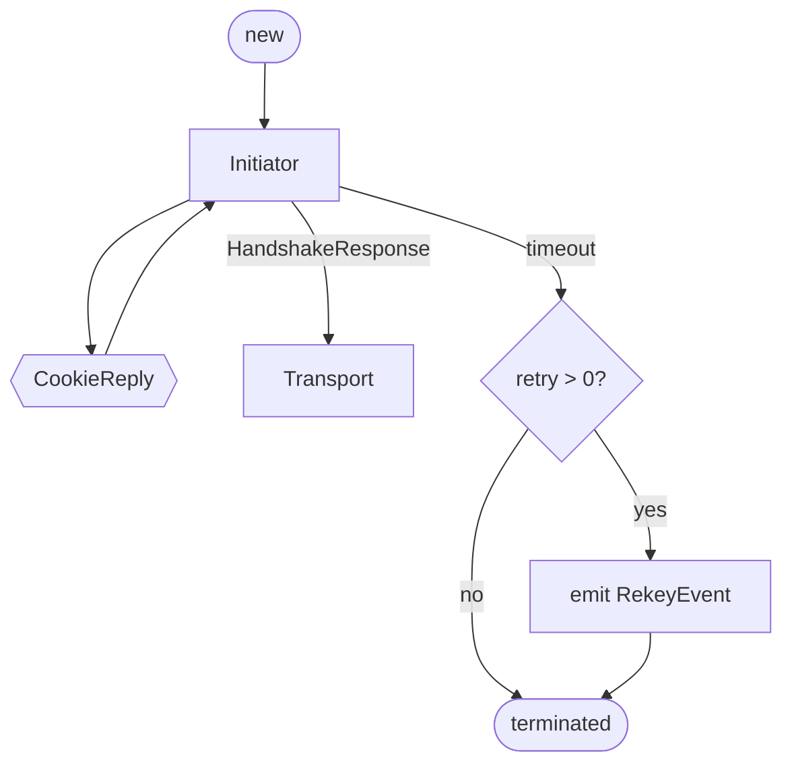
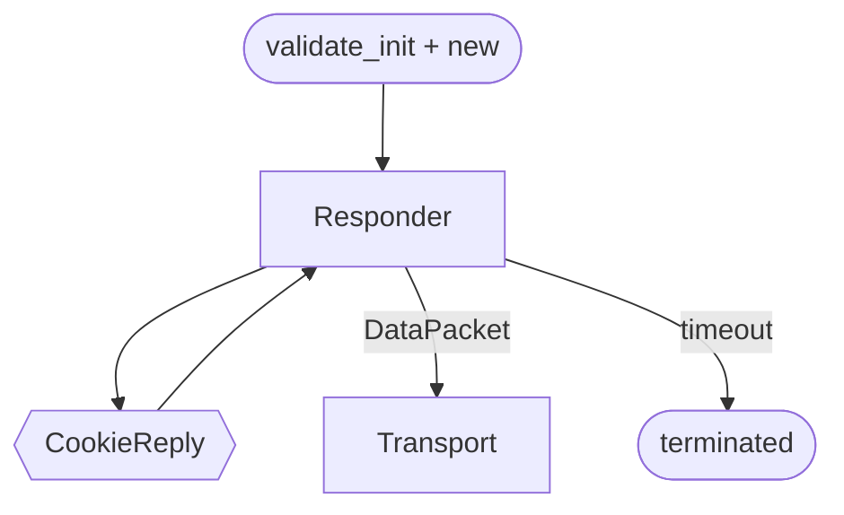
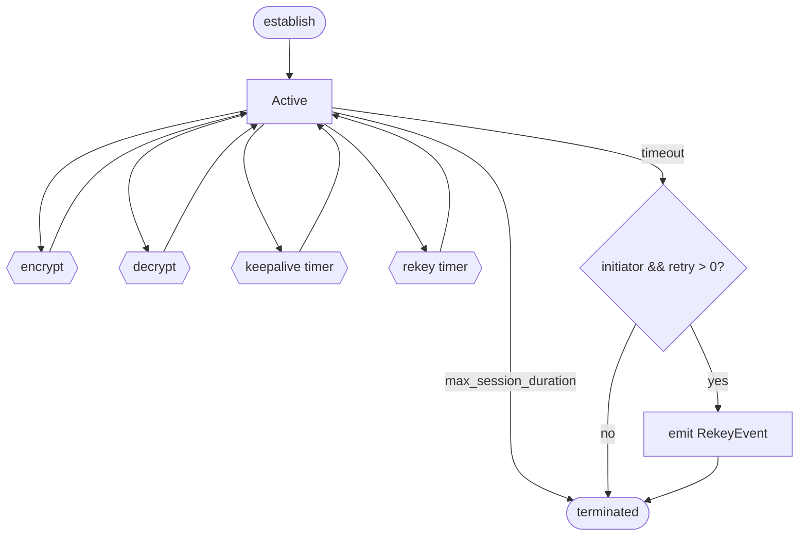

# Session

## Initiator

| State | Event | Next State | Actions |
|-------|-------|------------|---------|
| - | new() | Init | send HandshakeInit, start session_timeout |
| Init | CookieReply | Init | store cookie |
| Init | HandshakeResponse | Transport | validate, establish transport, start session_timeout/rekey/max_session_duration, send empty DataPacket |
| Init | timeout (retry > 0) | terminated | decrement retry, emit RekeyEvent |
| Init | timeout (retry == 0) | terminated | - |

## Responder

| State | Event | Next State | Actions |
|-------|-------|------------|---------|
| - | validate_init() + new() | Resp | send HandshakeResponse, start session_timeout |
| Resp | CookieReply | Resp | store cookie |
| Resp | DataPacket | Transport | decrypt, establish transport, start session_timeout/keepalive/max_session_duration |
| Resp | timeout | terminated | - |

## Transport

| State | Event | Next State | Actions |
|-------|-------|------------|---------|
| - | establish | Active | - |
| Active | encrypt() | Active | increment send_nonce, reset keepalive |
| Active | decrypt() | Active | check replay, reset session_timeout |
| Active | keepalive timer | Active | send empty DataPacket, reset keepalive |
| Active | rekey timer | Active | emit RekeyEvent |
| Active | timeout (initiator, retry > 0) | terminated | decrement retry, emit RekeyEvent |
| Active | timeout (other) | terminated | - |
| Active | max_session_duration | terminated | - |
